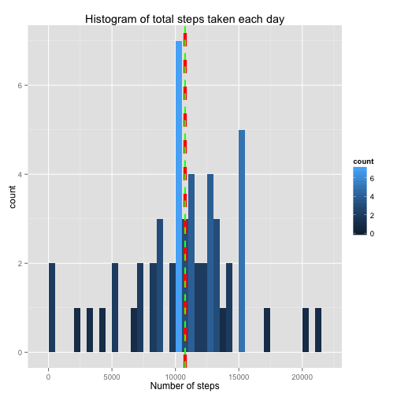
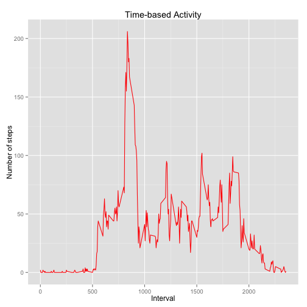
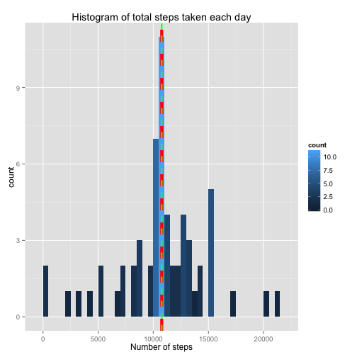
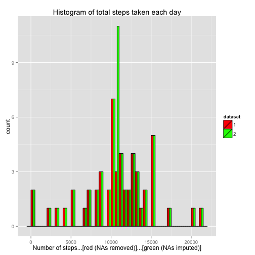
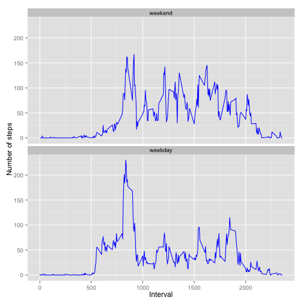

### Introduction

It is now possible to collect a large amount of data about personal movement using activity monitoring devices such as a [Fitbit][1], [Nike FuelBand][2], or [Jawbone Up][3]. These type of devices are part of the "quantified self" movement -- a group of enthusiasts who take measurements about themselves regularly to improve their health, to find patterns in their behavior, or because they are tech geeks. But these data remain under-utilized both because the raw data are hard to obtain and there is a lack of statistical methods and software for processing and interpreting the data.

[1]: http://www.fitbit.com/ "Fitbit"

[2]: http://www.nike.com/us/en_us/c/nikeplus-fuel "Nike FuelBand"

[3]: https://jawbone.com/up "Jawbone Up"


This report uses the data from a personal activity monitoring device. This device collects data at 5 minute intervals through out the day. The data consists of two months of data from an anonymous individual collected during the months of October and November, 2012 and include the number of steps taken in 5 minute intervals each day.

### Data

The data for this report has been downloaded from the coursera web site:

- Data set: [Activity monitoring data] [4] [52k]

[4]: https://d396qusza40orc.cloudfront.net/repdata%2Fdata%2Factivity.zip "Activity monitoring data"

The variables included in this data set are:

- **steps**: Number of steps taking in a 5-minute interval (missing values are coded as NA).

- **date**: The date on which the measurement was taken in YYYY-MM-DD format.

- **interval**: Identifier for the 5-minute interval in which measurement was taken.

The data set is stored in a comma-separated-value (CSV) file and there are a total of 17,568 observations in this data set.

### Loading and preprocessing the data


```r
## Load required packages

library(dplyr)
```

```
## 
## Attaching package: 'dplyr'
## 
## The following object is masked from 'package:stats':
## 
##     filter
## 
## The following objects are masked from 'package:base':
## 
##     intersect, setdiff, setequal, union
```

```r
library(ggplot2)

## Load data

GrossActivity <- read.csv(unzip("./RepData_PeerAssessment1/activity.zip"), header = TRUE, sep = ",")
GrossActivity$date <- as.Date(GrossActivity$date, format = "%Y-%m-%d")
```

In this report we will try to address different questions by analyzing the data in different ways.

### The mean total number of steps taken per day

- For this part of the report, we may exclude the rows of data set containing missing values i.e. NAs.


```r
## Remove rows having NAs

NetActivity <- filter(GrossActivity, steps != "NA")
```

1. Calculate the total number (along with mean and median) of steps taken per day.


```r
## Summarize steps taken per day

SumNetActivity <- NetActivity %>%
        select(steps, date) %>%
        group_by(date) %>%
        summarize(SumSteps = sum(steps))

## Calculate the mean and median of total number of steps taken each day

SumStepsMean <- round(mean(SumNetActivity$SumSteps), 0)
SumStepsMedian <- round(median(SumNetActivity$SumSteps), 0)
```

2. Make a histogram of the total number of steps taken each day. Also report the mean and median of the total number of steps taken per day.


```r
## Make a histogram of total steps taken each day (show mean & median also)

g <- ggplot(SumNetActivity, aes(SumSteps))
g + geom_histogram(aes(fill = ..count..), binwidth = 500) +
        geom_vline(xintercept = SumStepsMean, col = "red", lty = 2, lwd = 2) +
        geom_vline(xintercept = SumStepsMedian, col = "green", lty = 2, lwd = 1) +
        labs(title = "Histogram of total steps taken each day", x = "Number of steps")
```

 

The histogram of the total number of steps taken by anonymous individual indicates that the count/frequency of the total number of steps taken between **10,001 to 10,500** appears to be maximum i.e. **count = 7**. The mean of the total number of steps taken is shown by a red vertical dashed line while a thin green vertical dashed line (almost at the same point on x-axis where the mean lies) shows the median.

The vertical lines showing placement of **mean** and **median** almost overlap each other because of the fact that the difference between **mean = 10766** and **median = 10765** is almost negligible.

```r
SumStepsMean
```

```
## [1] 10766
```


```r
SumStepsMedian
```

```
## [1] 10765
```


**While we have examined the pattern of total number of steps taken each day, it is pertinent to explore**

### The average daily activity pattern

For this purpose we will have to calculate average of each 5-minute interval across all days.


```r
## Summarize average steps taken per time interval

TimeActivity <- NetActivity %>%
        select(steps, interval) %>%
        group_by(interval) %>%
        summarize(TimeMean = round(mean(steps))) %>%
        select(interval, steps = TimeMean)
```

Make a time series plot of the 5-minute interval (x-axis) and the average number of steps taken, averaged across all days (y-axis)


```r
## Make a time series plot of 5-minute interval and average steps

g <- ggplot(TimeActivity, aes(interval, steps), type = "l")
g + geom_line(col = "red") +
        labs(title = "Time-based Activity", x = "Interval", y = "Number of steps")
```

 

The plot shows maximum number of average steps at 5-minute time interval as below:


```r
## Find out the 5-minute interval with maximum number of average steps

MaxInterval <- TimeActivity[which.max(TimeActivity$steps),]
MaxInterval
```

```
## Source: local data frame [1 x 2]
## 
##   interval steps
## 1      835   206
```

### Imputing missing values

We have played till now with a data set obtained after exclusion of missing values (NAs). The results may differ a bit after imputing missing values.

In order to impute missing values, we first need to find and extract the rows of original data set containing missing values i.e. **NAs** as under:


```r
## Create a subset with missing values and impute the same

ImpActivity <- filter(GrossActivity, is.na(steps))
NArows <- nrow(ImpActivity)
colnames(TimeActivity) [2] <- "steps"
```

The new data set contains 2304 rows with all missing values in variable 'steps'.

```r
NArows
```

```
## [1] 2304
```

The process of imputing missing values depends upon the nature of available data/values. In this case it will a good decision to impute missing values with the means of steps taken in the respective 5-minute interval which have already been calculated.

Now we may replace NAs with the averages of the same time interval.


```r
ImpActivity$steps <- TimeActivity$steps[TimeActivity$interval %in% ImpActivity$interval]
```

Merge the data sets with observations (available and imputed) to create a new data set having no missing values and equal in size with the original data set.


```r
## Create new data set with no missing values

Activity <- rbind(ImpActivity, NetActivity)
Activity <- arrange(Activity, date, interval)
```

We can now confirm that the new data set contains 17568 observations/rows and no missing values.


```r
nrow(Activity)
```

```
## [1] 17568
```

```r
anyNA(Activity$steps)
```

```
## [1] FALSE
```

In order to have a visual look at the new data set, we create a histogram of the total number of steps taken each day. Also calculate and report the mean and median total number of steps taken per day.


```r
## Summarize the new data set for total number of steps taken each day

NewActivity <- Activity %>%
        select(steps, date) %>%
        group_by(date) %>%
        summarize(SumSteps = sum(steps))

## Calculate the mean and median of total number of steps taken each day

NewStepsMean <- round(mean(NewActivity$SumSteps), 0)
NewStepsMedian <- round(median(NewActivity$SumSteps), 0)

## Make a histogram

g <- ggplot(NewActivity, aes(SumSteps))
g + geom_histogram(aes(fill = ..count..), binwidth = 500) +
        geom_vline(xintercept = NewStepsMean, col = "red", lty = 2, lwd = 2) +
        geom_vline(xintercept = NewStepsMedian, col = "green", lty = 2, lwd = 1) +
        labs(title = "Histogram of total steps taken each day", x = "Number of steps")
```

 

Now we look at the values of new mean (red vertical dashed line) and median (thin green vertical dashed line).


```r
NewStepsMean
```

```
## [1] 10766
```

```r
NewStepsMedian
```

```
## [1] 10762
```

**Impact of imputing missing data**

- We see that there is no change in the value of mean; both are equal to 10,766. The mean should not have been changed because we have imputed the missing values with the averages (means) of respective time intervals.

- The value of median has, however, gone down a bit from 10765 to 10762.

- Another change is seen in the count and bin. The highest count/frequency of occurrence has been increased from **7 to 11** and the bin with highest count has also shifted from **10001-10500** to **10501-11000.**

- The impact of imputing missing values on the estimates of daily total number of steps can be viewed as under:


```r
## Impact of imputing missing values - make a comparison

DF <- rbind(data.frame(dataset = 1, steps = SumNetActivity$SumSteps),
             data.frame(dataset = 2, steps = NewActivity$SumSteps))
DF$dataset <- as.factor(DF$dataset)
g <- ggplot(DF, aes(steps, fill = dataset))
g + geom_histogram(color = "black", position = "dodge", binwidth = 500) +
        labs(title = "Histogram of total steps taken each day",
             x = "Number of steps...[red (NAs removed)]...[green (NAs imputed)]") +
        scale_fill_manual(breaks = 1:2, values = c("red", "green"))
```

 

### Difference in activity patterns between weekdays and weekends

1. Create a new factor variable in the data set with two levels – “weekday” and “weekend” indicating whether a given date is a weekday or weekend day and summarize the data


```r
## Create a facor variable of weekdays with levels ("weekend", "weekday") and summarize data

weekdays1 <- c("Monday","Tuesday","Wednesday","Thursday","Friday")
SumWeekDays <- Activity %>%
        select(steps, date, interval) %>%
        mutate(WeekDay = factor((weekdays(date) %in% weekdays1) + 1L,
               levels = 1:2, labels = c("weekend", "weekday"))) %>%
        group_by(interval, WeekDay) %>%
        summarize(MeanSteps = round(mean(steps), 0))
```

2. Make a panel plot containing a time series plot (i.e. type = "l") of the 5-minute interval (x-axis) and the average number of steps taken, averaged across all weekday days or weekend days (y-axis).


```r
## Create panel plot

g <- ggplot(SumWeekDays, aes(interval, MeanSteps), type = "l")
g + geom_line(col = "blue") + facet_wrap("WeekDay", nrow = 2) +
        labs(x = "Interval", y = "Number of steps")
```

 
